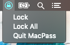
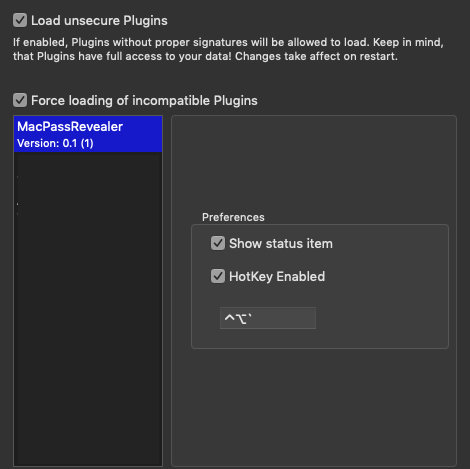

# MacPassRevealer
MacPass Plugin - Global Keyboard shortcut to hide/unhide MacPass

In order to use this plugin you have to check off "Load unsecure plugins" and "Force loading of incompatiable Plugins"
This is due to the signing of the mplugin, which you should build locally on your machine. 
I do recommend testing it out before making part of your production use. 

New Features: 

-Lock current database

-Lock all databases 

-Control Click or just a Right click now show menu

-User Defined HotKey - Enable/Disable 

-Menubar Icon (status item) - requires restart of MacPass after Enable/Disable

  **the restart is required for future feature implementation 

Screenshots:

Credit:

DDHotKey - for user customized hotkeys

MacPass (@mstarke) - MPSettings additions for DDHotKeys
