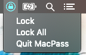
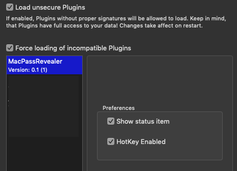

# MacPassRevealer
MacPass Plugin - Global Keyboard shortcut to hide/unhide MacPass

In order to use this plugin you have to check off "Load unsecure plugins" and "Force loading of incompatiable Plugins"
This is due to the signing of the mplugin, which you should build locally on your machine. 
I do recommend testing it out before making part of your production use. 

New Features: 

-Lock current database

-Lock all databases 

-Control and Right click now show menu

-Hotkeys

-Prefences options (within MacPass plugin prefs) to disable hotkey and/or menu item individually
  -requires relaunching of MacPass to take effect

The keyboard shortcut is hard configured as:
Control+Option+`

Screenshots:

